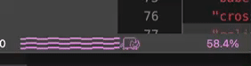

# [nyan-mode](https://github.com/zakudriver/nyan-mode-vscode)


>For some friends who like nyan but don't use emacs.

Emacs [nyan-mode](https://github.com/TeMPOraL/nyan-mode) for vscode.

## Features

Like emacs nyan-mode. It's an analog indicator of your position in the tab. The cat will go gradually from the left to the right on the statusbar in accordance with the progress from 0% to 100%.

Since vscode statusbar supports string only, so i only remake terminal edition.


## Screenshot



## Extension Settings

This extension contributes the following settings:

* `nyanMode.nyanDisable`: Enable or disable nyan-mode.
* `nyanMode.nyanAlign`: Nyan-mode show at statusbar of 'left' or 'right'.
* `nyanMode.nyanPriority`: Position priority, higher values mean nyan-mode should be shown more to the left.
* `nyanMode.nyanColor`: Nyan-mode color.
* `nyanMode.nyanLength`: Nyan-cat length.
* `nyanMode.nyanDisplayPercent`: If it's `true`, display position percent to the right of nyan.
* `nyanMode.nyanAction`: Nyan-mode action mode. The 'moving' mode which uses cursor activity to control the progress bar, and the ‘scrolling’ mode uses the scroll bar to control. 
* `nyanMode.nyanAnimation`: Nyan-mode animation mode. When turns to QUITE mode, nyan only be active when scroll or move the cursor, when turns to ACTIVE mode, nyan will be always active, and turns to NONE mode will be still.
* `nyanMode.nyanRainbowAnimation`: Nyan-mode rainbow animation. If it's `true`, rainbow will be active.
* `nyanMode.nyanFrames`: Nyan-mode animation frames. Not recommend to modify, it’s a balanced status between performance and effects.
* `nyanMode.nyanDiagnostics`: Nyan-mode diagnostics display. If it's `true`, nyan will display `error` and `warning` status for current tab by different colors to distinguish. Notice⚠️: `error` status has the highest priority, so nyan-cat will be `error` status when `nyanDisplayPercent` is `false`. (`error` and `warning` status color from `new ThemeColor("statusBarItem.errorBackground")` and `new ThemeColor("statusBarItem.warningBackground")`)

Default value:
```typescript
export interface NyanModeOptions {
  nyanDisable: boolean;                        // default: false
  nyanAlign: "left" | "right";                 // default: "left"
  nyanPriority: number;                        // default: 0
  nyanColor: string;                           // default: "#f99cf7"
  nyanLength: number;                          // default: 30
  nyanDisplayPercent: boolean;                 // default: false
  nyanAction: "scrolling" | "moving";          // default: "scrolling"
  nyanAnimation: "quiet" | "active" | "none";  // default: "quiet"
  nyanRainbowAnimation: boolean;               // default: true
  nyanFrames: number;                          // default: 20
  nyanDiagnostics: true;                       // default: true
}
```

## Known Issues

>Because I usually use emacs, so maybe have some bugs what i don't know ;(. Please submit issues if you find any problems, thx.

Now nothings.

## Release Notes

### 1.5.1

Optimize code for performance. And new feature `nyanDiagnostics`.

### 1.4.2

Optimize `onDidChangeTextEditorVisibleRanges` event.

### 1.4.1

Rainbow animation more smooth.

### 1.4.0

Now nyan's rainbow can be active. And expose the `nyanRainbowAnimation` options, if it's TRUE will be enable.

### 1.3.3

Expose the `nyanFrames` options. Not recommend to modify.

### 1.3.2

Optimize delay of between animation and event. 

### 1.3.1

To reduce debounceTime; optimize onDidChangeTextEditorSelection call; hide nyan and to unsubscribe.

### 1.3.0

Now nyan can animate!! And modify some config.

---

## Thanks list

Thanks to [hikari6688](https://github.com/hikari6688) for the nyan icon font

**Enjoy!**
